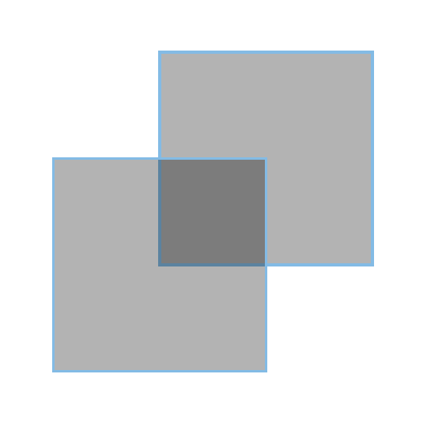

# Paintful Intersections

Filbert is an intern at Lucid Software who is working on a bug in **Lucid**press. He hasn't figured out why, but overlapping shapes with fill colors aren't being rendered correctly. Filbert checks the code and notices that one of the rendering functions is incorrectly calculating the area of shapes, so the browser is running out of paint! Help Filbert fix the calculation before more users' documents lose their color.

Filbert needs to write code to determine the area of pairs of intersecting shapes. Consider this example of two overlapping squares:

<div align="center">

</div>

Both squares have a side length of 10 units, and the second square is offset by 5 units in both the `x` and `y` dimension. Thus the overlapping area is a square with a side length of 5 units, which has an area of 25 units.

Here's another example with overlapping triangles:

<div align="center">

</div>

These equilateral triangles have a side length of 10 units. Recall that the formula for the area of a triangle is `(1/2)*b*h`, and for an equilateral triangle, the altitude is equal to `a*sqrt(3)/2`, where `a` is the side length. You'll notice that the overlapping region is equal to half the area of one of the triangles. So the total area of the overlapping region is:

```(1/2) * [(1/2)*b*h] = (1/2) * [(1/2)*a*(a*sqrt(3)/2)] = a^2*sqrt(3)/8 = 21.651```

<br>
Of course, Filbert can't calculate each of these areas by hand; most overlapping regions won't form such simple shapes anyway! Luckily, Filbert remembers he can calculate the area of a "simple polygon" (one whose sides do not intersect) using the "shoelace formula", so long as he orders the vertices in either clockwise/counterclockwise order:

<br>
<div align="center">

</div>

# Input

The input will describe two convex polygons. The first line will contain an integer `N < 100`, the number of sides for the first polygon. The next `N` lines will contain a pair of decimal numbers `(x, y`),  representing the coordinates of the first polygon's vertices. This will be followed by a line containing an integer `M < 100`, the number of sides for the second polygon. The last `M` lines will contain the coordinates for the second set of vertices in the same fashion.

**The list of vertices for each polygon can be in any order.**

Don't forget to account for cases where the polygons are completely disjoint (the area is zero) or where one polygon is contained entirely within the other (the area is the area of the contained polygon)!

# Output

The area of the intersection of the two polygons, rounded to 3 decimal places.

# Examples

<table>
    <tr>
        <th>Input</th>
        <th>Input</th>
    </tr>
    <tr>
        <td><pre>4
0.0 0.0
10.0 10.0
0.0 10.0
10.0 0.0
4
5.0 5.0
15.0 15.0
5.0 15.0
15.0 5.0
</pre></td>
        <td><pre>3
0 0
10 0
5 8.66025403784
3
0 8.66025403784
10 8.66025403784
5 0</pre></td>
    </tr>
    <tr>
        <th>Output</th>
        <th>Output</th>
    </tr>
    <tr>
        <td><pre>25.000</pre></td>
        <td><pre>21.651</pre></td>
    </tr>
</table>
