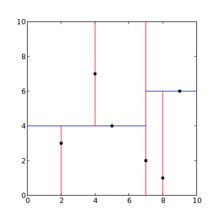

# Spatial Indexing

A Lucidchart or Lucidpress document is made up of a list of items on the page. When the user performs an action (a click or drag, for example), we often need to look through this list for nearby items to know how to handle the user input (select a block, connect a line). Unfortunately, for documents with lots of shapes searching through the entire list takes too long.

For this problem we'll simplify each shape to just it's center point.
We need to find which shape on the page is closest to where the user action occured.
The next section gives some information on k-d trees, which will be very helpful in constructing a 2-d tree for solving this problem.

## k-d Trees

A k-dimensional tree is a space-partitioning data structure devised to allow fast querying of points in k-dimensions.
It is usually implemented as a binary tree, where each layer partitions the points along an axis. The axis of division cycles through the dimensions as you decend the tree. For example, in 3 dimentions: first x, then y, then z, then x, etc. Each node contains a single point, and all points in the left sub-tree are less than or equal to that point with respect to the current axis, and all points in the right sub-tree are greater than or equal to that point with respect to the current axis.

Given a list of points, the following recursive algorithm uses a median-finding sort to construct a balanced k-d tree containing those points.
```
function kdtree (list of points pointList, int depth)
{
    // Select axis based on depth so that axis cycles through all valid values
    axis := depth mod k;

    // Sort pointList and choose median as pivot
    select median by axis from pointList;

    // Create node and construct subtree
    node.location := median;
    node.leftChild := kdtree(points in pointList before median, depth+1);
    node.rightChild := kdtree(points in pointList after median, depth+1);
    return node;
}
```

## Input

The first line is a single integer N, the number of points on the page.
Each of the next N lines consists of two integers `x y` separated by a space.
After that is one line with a single integer T, the number of test cases.
Each of the next T lines contain a single point in the same format as before.

#### Constraints
```
0 < N <= 200000
0 < T <= 200000
-10000 <= x <= 10000
-10000 <= y <= 10000
```

## Output

For each of the `T` test cases, output a single line in the same format as it was given containing the point on the page that is closest to the test point.
If two points on the page are the same distance away, choose the one that comes first when sorted (ascending order by x, then y).

<br>

## Example

<table>
    <tr>
        <th>Input</th>
        <th>Output</th>
    </tr>
    <tr>
        <td>
<pre>
6
2 3
4 7
5 4
7 2
8 1
9 6
2
2 8
6 4
</pre>
        </td>
        <td>
<pre>
4 7
5 4
</pre>
        </td>
    </tr>
</table>

Here are some diagrams of the 2-d tree for the example input.



