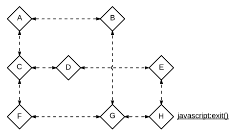

# Stuck

Through means unknown, you been stuck in a diagram!

One shape has an exit link. To extricate yourself from the diagram, you must move from shape to shape and reach the link.
There are five available functions for moving:

```
down()    // move to the nearest shape below the current
left()    // move to the nearest shape left of the current
right()   // move to the nearest shape right of the current
up()      // move to the nearest shape above the current
random()  // randomly move to any shape (including the current)
```

What is the fewest average function calls required to reach the exit?

Consider the following example, where the exit link is at shape H:

<div align="center">

</div>

If you started at D, you would call `right(); down();` so the fewest average calls are 2.

If you started at A, you *could* call `right(); down(); right();`. But it's actually optimal on average to call
`random();` Subsequent calls depend on the result. There's a 1/8 chance you reach H, and immediately exit. There's a
1/8 chance you would remain on A, and call `random();` again. The average number of function calls of the optimal
strategy is 2.333.

# Input

The positions of the shapes is given as a grid. The first line is two space-separated integers 0 <= R, C <= 100, which are the numbers of rows and columns. The
following R rows each have C characters. An `A` represents the starting shape, a `B` represents the ending shape, an
`O` represents another shape, and a `-` represents empty space.

# Output

The minimum average function calls, accurate to within 0.001.

# Examples

<table>
    <tr>
        <th>Input</th>
        <th>Input</th>
        <th>Input</th>
    </tr>
    <tr>
        <td><pre>3 4
O-O-
OA-O
O-OB</pre></td>
        <td><pre>3 4
A-O-
OO-O
O-OB</pre></td>
        <td><pre>2 2
B-
-A</pre></td>
    </tr>
    <tr>
        <th>Output</th>
        <th>Output</th>
        <th>Output</th>
    </tr>
    <tr>
        <td><pre>2.000</pre></td>
        <td><pre>2.333</pre></td>
        <td><pre>2.000</pre></td>
    </tr>
</table>
